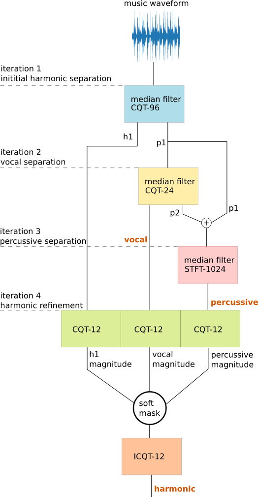
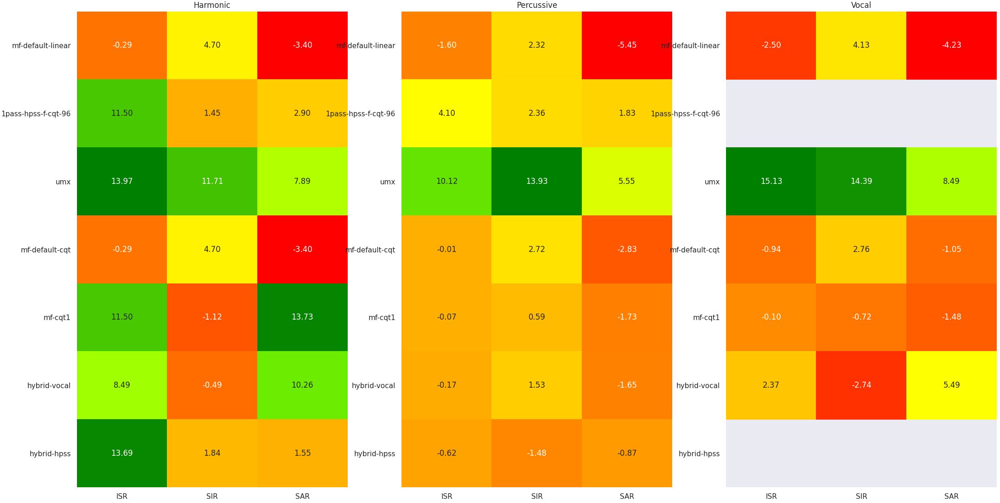
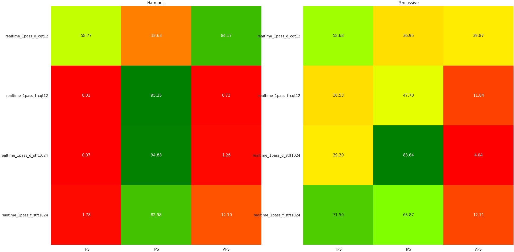

# Music-Separation-TF

Music-Separation-TF contains a collection of MATLAB implementations for HPSS (harmonic/percussive source separation) and harmonic/percussive/vocal source separation:

| Algorithm | Components | Technique |
| ------------- |--| ------------- |
| [(1)](http://dafx10.iem.at/papers/DerryFitzGerald_DAFx10_P15.pdf) HPSS | Harmonic/percussive | Median-filtering the STFT with soft masks |
| [(2)](https://www.audiolabs-erlangen.de/content/05-fau/assistant/00-driedger/01-publications/2014_DriedgerMuellerDisch_ExtensionsHPSeparation_ISMIR.pdf) Iterative HPSS | Harmonic/percussive/residual | Iterative median-filtering with 2 STFTs and hard masks |
| [(3)](https://arrow.tudublin.ie/cgi/viewcontent.cgi?article=1007&context=argart) Iterative HPSS with CQT | Harmonic/percussive/vocal |  Iterative median-filtering with 2 STFTs, or 1 STFT and 1 CQT, for vocal source separation |
| [(4)](https://hal.archives-ouvertes.fr/hal-00350152/document) Time-Frequency Jigsaw Puzzle [(ltfat1](https://ltfat.github.io/doc/sigproc/tfjigsawsep_code.html), [ltfat2)](https://github.com/ltfat/ltfat/blob/00c2929ef069d294dd84974af8887a9b91d1f994/sigproc/tfjigsawsep.m) | Harmonic/percussive/residual | TF supertiles with 1 high 1 low frequency resolution Gabor analysis + entropy criterion with threshold |
| [(5)](https://www.dafx.de/paper-archive/2011/Papers/51_e.pdf) WMDCT group lasso [(ltfat](https://ltfat.github.io/doc/demos/demo_audioshrink.html), [site)](https://homepage.univie.ac.at/monika.doerfler/StrucAudio.html) | Harmonic/percussive | 2 Gabor systems with WMDCT frames for tonal/transient representation + group lasso in time and frequency |
| [(6)](https://github.com/sevagh/Real-Time-HPSS) Realtime HPSS with STFT | Harmonic/percussive | Single-pass HPSS adapted to work in realtime with a sliding STFT and causal median filter |
| [(7)](https://www.univie.ac.at/nonstatgab/pdf_files/dogrhove12_amsart.pdf) Realtime HPSS with sliCQ transform | Harmonic/percussive | Single-pass HPSS adapted to work in realtime with a sliCQ (sliced Constant Q Nonstationary Gabor Transform) |

## Evaluations

Evaluations were mostly done using the [PEASS Toolkit](http://bass-db.gforge.inria.fr/peass/) (but a little bit with SigSep's [BSS Eval v4](https://github.com/sigsep/bsseval/)), against a selection of tracks from the [MUSDB18-HQ](https://zenodo.org/record/3338373) test set (not train, to avoid overfitting when comparing neural models trained on MUSDB18). Results are stored as [heatmaps](./evaluation/heatmaps) generated with seaborn, using a red-orange-yellow-green color scale to denote bad-to-good results (in that order).

In addition to the above MATLAB algorithms, [SigSep's Open-Unmix](https://sigsep.github.io/open-unmix/) neural network was evaluated as a high-performance baseline.

## Hybrid algorithms

Based on the results of the evaluation, different algorithms or parameters were combined to try and create optimal algorithms (using the evaluated MATLAB algorithms as base building blocks). The results are:
* [HarmonicPercussive.m](./algorithms/HarmonicPercussive.m), a hybrid algorithm with TFJigsaw + median-filtering STFT
* [HarmonicPercussiveVocal.m](./algorithms/HarmonicPercussiveVocal.m), a hybrid algorithm with 4 iterations of CQT and STFT median filtering

Block diagram of the better-performing Harmonic-Percussive-Vocal system:

These scored respectably in PEASS, and represented an improvement over the base DSP algorithms in the BSSv4 scores:

A surprising outcome was the strong performance of applying the original single-pass soft-masking median filtering of Fitzgerald on a CQT with 96 bins per octave (1pass-hpss-f-cqt-96). This insight contains the seed of my subsequent neural network solution [MiXiN](https://github.com/sevagh/MiXiN), which combines the basic HPSS algorithm with [Convolutional Denoising Autoencoders](https://arxiv.org/abs/1703.08019).

## Realtime algorithms

Realtime variants of HPSS were evaluated, using either a sliding STFT or sliced CQT:

The low quality of the harmonic separation is expected, since the causal median filter is half the length (and only has access to half of the harmonic content) of the anticausal median filter from the offline case. The percussive separation quality is acceptable.

Realtime HPSS with sliding STFT is implemented in MATLAB, with a stream size of 1024 (implying a hop of 1024 and frame size of 2048), which takes 0.621ms per iteration in MATLAB (the same idea leads to a [very fast CUDA implementation](https://github.com/sevagh/Zen)).

Realtime HPSS with the sliCQ is implemented in Python, since the [Python NSGT package](https://github.com/grrrr/nsgt) has a version of sliCQ that's more usable in a realtime context, compared to the [MATLAB NSGToolbox](http://nsg.sourceforge.net/). It also uses a stream size of 1024 (implying a transition area of 1024 and a slice length of 4096), but the computational cost of the sliCQ implementation is high, leading to ~50ms per iteration. Since the sliCQ returns 3 sets of coefficients, the median filter is applied against the (3, X, Y)-dimension coefficients, 3x more than the STFT case. Next, a stream size of 1024 (slice length 4096) is so small that the desired 12 bins per octave at constant Q has frequencies that cannot be realized - meaning larger would be _even better_. More work is needed to find the best way of using the sliCQ in a realtime HPSS algorithm.

Performance numbers in this repository are not a final judgement, since better implementations can be written once a concept is validated.

## Installation and usage

The entire project is a mix of modular MATLAB and Python scripts. The general procedure for getting things running is this:

1. Clone the repository **with submodules** - `git clone --recurse-submodules --remote-submodules`
    1. If you've already cloned it without submodules, you can run `git submodule update --init`
2. Navigate to the repo from MATALAB, and run `init.m` (adds vendored LTFAT and PEASS to path)
    1. If necessary, recompile LTFAT and PEASS .mex files from the vendor directory instructions
3. Acquire a stem database, e.g. [MUSDB18-HQ](https://zenodo.org/record/3338373), and run [data/prepare_data.py](./data/prepare_data.py) script against the directory of stems. This searches the filename for "drum", combines everything else (except "mix") into "harmonic" (use `--vocals` to add a vocal component), chops the files up into segments (30s by default), and puts them in `data/data-{vocal, hpss}`.
5. Navigate to `./evaluation` and run [eval_hpss](./evaluation/eval_hpss.m) to evaluate harmonic/percussive source separation. Pass in the name of the contender file, containing function handles to algorithm invocations with different parameters. For example, run set 2 of TFJigsaw configurations with `eval_hpss('jigsaw2')`. Browse the [full list of contenders](./evaluation/contenders) or create your own.
7. Run [eval_vocal](./evaluation/eval_vocal.m) to evaluate harmonic/percussive/vocal source separation.

## Report

The [latex](./latex) directory contains a presentation and report, presented for MUMT 622, Winter 2021. The report describes the algorithms from the perspective of time-frequency analysis, frame theory, and Gabor dictionaries. It also contains an overview of the [MiXiN](https://github.com/sevagh/MiXiN) neural network solution and some evaluations and comparisons with Open-Unmix in the appendix.
